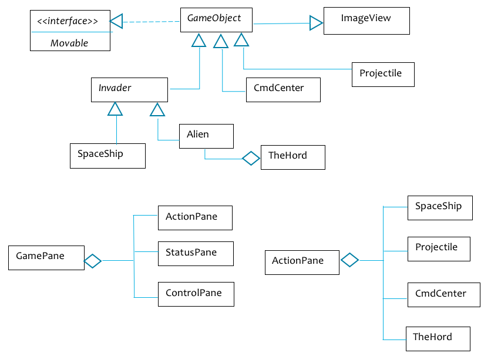
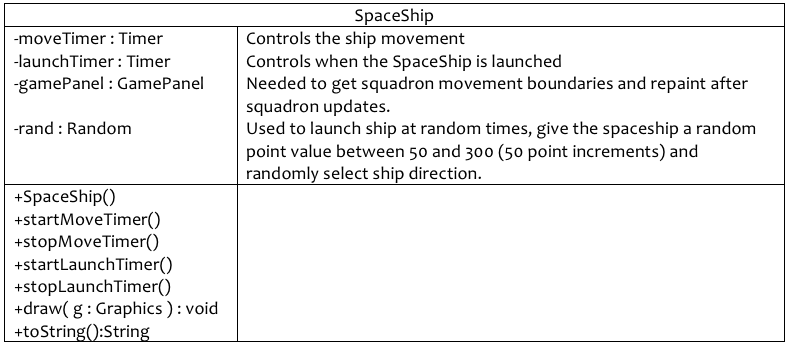
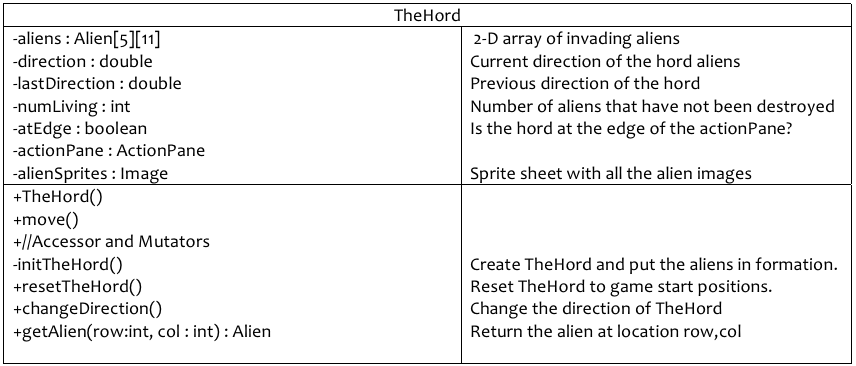

# Major Program 3
## COMP 167 Spring 2019
### 4/24/2019 at 6:00 pm

## Introduction

This assignment requires you to create a Java game application similar to the video classic named Space Invaders.  You are required to use my design or you will not receive credit for the program.  Some deviation is okay but discuss it with me first.



## Classes and Interfaces

You are required to implement the following classes at a minimum.   You may add other classes (and methods) if you need them.

### GameObject Class (Abstract)


### Invader Class (Abstract)

Serves as a superclass for all Alien Invaders.


### CmdCenter Class

Base station for firing projectiles.  Only one projectile can be active at a time.  The station is moved using the keyboard arrow keys and the projectile is fired using the spacebar.


### Projectile Class

Projectiles are fired by the CmdCenter.  Only one projectile will be active.


### SpaceShip Class

This class defines the ship the moves across the top of the screen at random intervals.  The Spaceship will have two timers.  One timer to control launching the ship a random intervals between 5 and 25 seconds and another Timer to control the SpaceShip animation.  The SpaceShip can be launched moving east to west or moving west to east.



### Alien Class

One of the invaders in the large 2-D array of the Squadron.


### TheHord Class

2-D array of Alien objects.



### ActionPane Class

All of the animated objects of the game are placed  and manipulated in this Pane by the GamePane class. The ActionPane is placed in the Center zone of the GamePane.  You are free to change the background color or place a “space-like” background in this Pane.  My game pane is 550 x 600 pixels.


### _Movable_ (Interface)


### GamePane

This is the heart of your application.  It will include all the major game objects and the keyboard listener.


## Notes

The GamePane will also contain the event handlers for your game.  This includes handlers for the Buttons, keyboard arrow keys to move the CmdCenter and extended an extended AnimationTimer to control automated movement of the Projectile, SpaceShip and TheHord.  So, this class will include additional properties not listed here.  We will discuss and release additional information to guide you with implementing this important container class.

### Displaying an Image in an ImageView object

All of your movable objects are extended ImageView objects.  The following was used to display the Command Center image on the sprite sheet.

```
//Read in the entire sprite sheet from disk.
try {           
Image image = new Image( new FileInputStream("images/alienspritesheet.png"));
this.setImage(image);
}
catch (java.io.FileNotFoundException ex) {
System.err.println(ex.getMessage());
System.exit(-1);
}

//Specify which portion of the sprite sheet you want displayed. by giving the (x,y)  
//location of the top-left corner and the width and the height.
Rectangle2D viewportRect = new Rectangle2D(217, 16, 21, 15);

//As a matter of preference, I scaled the image to make it appear larger.
this.setScaleX(1.5);
this.setScaleY(1.5);

//Set the viewport for this ImageView object (CmdCenter in this case).
this.setViewport(viewportRect);

//Set the width and height of the containing pane so that you will know when you
//have moved the CmdCenter to the edge of the screen.        
setParentWidth(actionPane.getPrefWidth());
setParentHeight(actionPane.getPrefHeight());

//Give an initial location to the CmdCenter
this.setX(getParentWidth/2);
this.setY(getParentHeight - 30);
```

### Moving example

The following will move an object on the screen n number of pixels in the d direction where n is specified by the method getSpeed() d is specified by getDirection().  In this case these are getter methods from the GameObject class.  This code would appear in the move() method of one of the GameObject subclasses.

```
double newX = this.getX() + getSpeed() * Math.cos(Math.toRadians(getDirection()) );
double newY = this.getY() + getSpeed() * Math.sin(Math.toRadians(getDirection()) ;
this.setX( newX );
this.setY( newY );
```

## Grading

If your project does not compile, it receives a grade of zero.  If you do not document your program according to the documentation guidelines, the graders have been instructed to deduct up to 25%.

**Level 1 (30 points):** implement Movable, GameObject, CmdCenter and ActionPane. Also implement enough of the GamePane so that the user can move the CmdCenter laterally across the screen to the bounds of the ActionPane using the left and right arrow keys.

**Level 2 (10 points):** Implement the Projectile class along with its needed AnimationTimer.  You should now be able to move the CmdCenter and fire projectiles.

**Level 3 (15 points):**  Implement the Invader and SpaceShip classes.  Your projectile should be able to detect when it makes contact with the spaceship.  When there is contact, the spaceship and projectile will disappear.

**Level 4 (15 points):**  Add the StatusPane and the ControlPane to the GamePane.  The StatusPane should display the current number of points earned and other desired status information.  The ControlPane should allow the user to use the mouse to start a game, restart a game and exit the application.

**Level 6 (30 points):**  Implement the Alien and TheHord classes.  You should create three different types of Aliens by using three different images.  The bottom two rows of Aliens have the same image and are worth 10pts each.  The next two rows of Aliens are worth 20pts and the final row of Aliens are worth 40pts.  Your projectile can only destroy the lowest Alien in each column.  TheHord should move faster after every 4 calls to the movement timer and drop down lower once it reaches the boundary of the GamePanel.  Once all the Aliens have been destroyed, TheHord should be reset; however it should start at one vertical level lower than the previous level.  You have to determine the lowest level that TheHord can start based on the height of your CmdCenter.  The game is over once any Alien reaches a position below the height of the CmdCenter.

**Extra Credit:**

(10 points)  Implement projectiles originating from the Aliens toward the ground.  The game will start with 3 lives (CmdCenter) .  Once the 3 CmdCenters have been destroyed or the Aliens have reached the ground, the game is over.  Show some indication of the remaining lives in your StatusPanel.

(5 points): Add an additional Timer such that pointsValue of the spaceship appears for a couple of seconds after a projectile hits the spaceship.
